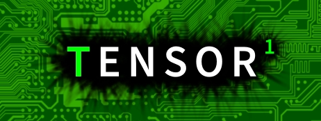

---
# Feel free to add content and custom Front Matter to this file.
# To modify the layout, see https://jekyllrb.com/docs/themes/#overriding-theme-defaults

layout: home
youtubeId: G_B89tX9v88
vimeoId: 1020847967
---

Tensor 1 is a first-person action adventure video game set in a strange underground facility. Coming Soon to PC, Mobile, and Web.

### Gameplay Trailer



### Features
- [**Campaign**]():\* Explore the facility and discover its secrets. Piece together the whole story across different campaigns from different perspectives! (Currently 2 story campaigns available)
- [**Survival**](): See how many floors you can clear in the endless survival gauntlet, with the help of 40 upgrades and items to collect along the way!
- [**Versus**]():\*\* Connect with friends over a Local Area Network (LAN) and face off in competitive death match, team death match, or capture the flag!
- [**Editor**]():\*\* Express yourself creatively and enjoy truly endless replay value with a built-in tile editor to make your own levels!
- [**And More?**]() For obvious reasons, we can't and don't want to make promises about the very uncertain future, but there are ideas we'd like to try out and potentially add in future updates.

[Buy Now!](){: .btn .btn-green }

- \* *Non-Steam versions of the game do not contain all story campaigns.*
- \*\* *Not available in non-Steam versions of the game.*

### Screenshots

### More Information
- [About]()
- [Manual]()
